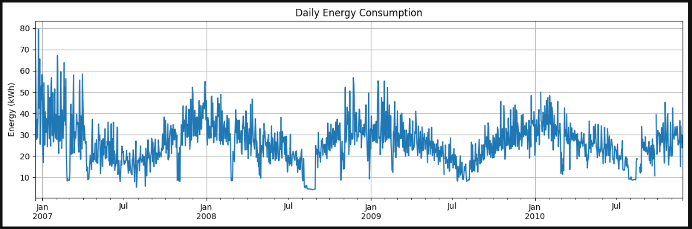
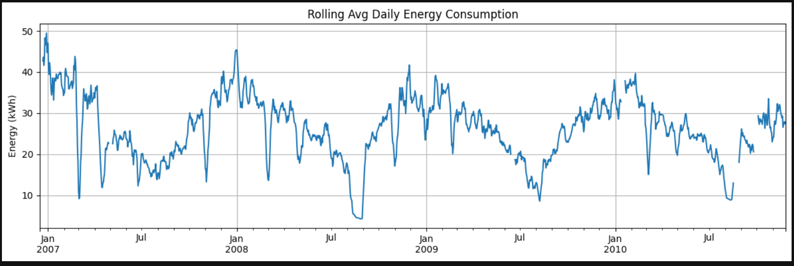
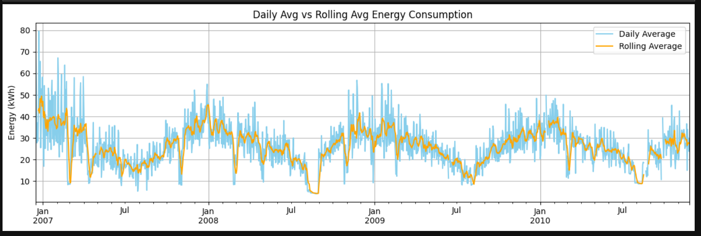
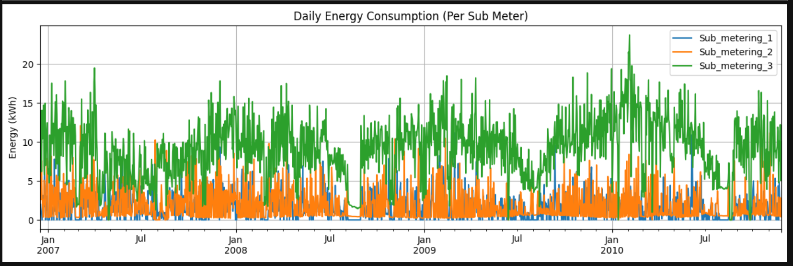
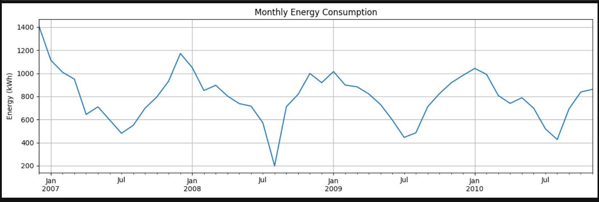
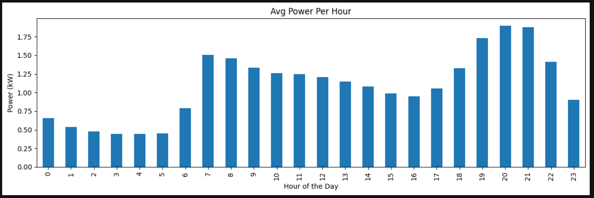
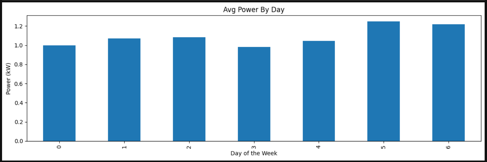

# Energy Data Analysis

Statistical analysis and anomaly detection on 4 years of household energy consumption data using Python.

## Overview

This project analyzes household energy consumption patterns from 2006-2010, identifying temporal trends and unusual usage behaviors through statistical methods. The analysis reveals seasonal variations, holiday effects, and actionable patterns in daily power consumption.

## Key Features

- Time series decomposition and trend analysis
- Statistical anomaly detection using 2-sigma threshold method
- Daily and hourly consumption aggregation
- Seasonal pattern identification
- Temporal visualization and exploration

## Dataset

Hebrail, G. & Berard, A. (2006). Individual Household Electric Power Consumption [Dataset]. UCI Machine Learning Repository. https://doi.org/10.24432/C58K54.

Household energy consumption data spanning 2006-2010 with:
- Hourly global active power readings
- Missing value handling and data quality assessment
- 4+ years of continuous monitoring

## Technical Stack

- Python
- Pandas (data manipulation and time series handling)
- Matplotlib (visualization)

## Analysis Components

### 1. Data Loading & Exploration
- Load household energy data
- Handle missing values
- Initial statistical summary
- Temporal data validation

### 2. Time Series Analysis
- Resample data to daily averages
- Calculate rolling statistics
- Identify trends and seasonality
- Visualize consumption patterns

### 3. Anomaly Detection
- Compute mean and standard deviation of daily consumption
- Apply 2-sigma threshold (mean + 2*std)
- Flag anomalous days exceeding threshold
- Analyze temporal distribution of anomalies

### 4. Key Findings

Anomaly detection identified 50+ unusual consumption days, predominantly:
- Winter holidays (December 16-31, January periods)
- Scattered months across 2007-2010
- Consumption patterns suggesting seasonal heating/cooling effects
- Holiday periods with behavioral shifts

## Results

**Anomalies Detected**: 50+ days with consumption exceeding mean + 2 standard deviations

**Temporal Pattern**: 
- Heavy clustering in December-January
- Anomalies span entire 4-year period
- Suggests seasonal and holiday-driven variations

**Statistical Threshold**: Anomalies identified where daily consumption significantly deviates from baseline, revealing periods of unusual household behavior or energy demand.


## Visualizations

- Daily average energy consumption over time
- Anomaly detection results with threshold line
- Seasonal trend patterns
- Temporal distribution of outliers















## Getting Started

1. Clone repository
2. Install dependencies: `pip install pandas matplotlib`
3. Run analysis notebook
4. Review visualizations and anomaly detection results

## File Structure

```
energy-data-analysis/
├── energy_data_analysis.ipynb
├── README.md
├── Visualizations/
│   ├── image.png
│   ├── image-1.png
│   ├── image-2.png
│   ├── image-3.png
│   ├── image-4.png
│   ├── image-5.png
│   └── image-6.png
└── Dataset/
    └── household_energy_data.txt
```

## Insights & Applications

This analysis demonstrates practical approaches for:
- Energy consumption monitoring
- Anomaly-based fault detection
- Seasonal demand forecasting
- Household efficiency optimization
- Grid demand pattern analysis


